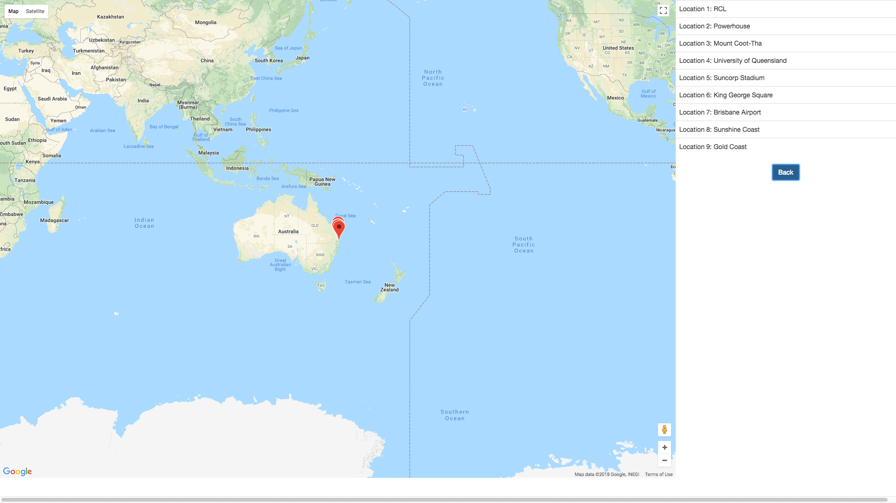
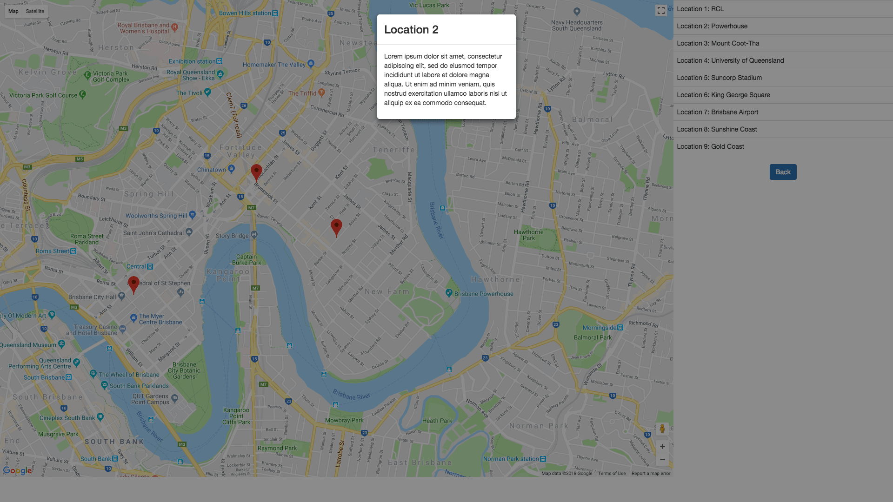

# AngularJS Test

This project was completed as part of the interview process for [FlyFreely](https://www.flyfreely.io/). The aim of this project is to display a list of locations on the map and implement the required UI interactions.

## Functionality
The required UI interactions are:
- Showing the list of markers in a list down the right hand side
- When the user clicks on a marker in the list, the map zooms to the marker
- When the marker on the map is clicked, a dialogue box shows up. There is only placeholder text in the dialogue.

## Technology
- Code: `AngularJS (1.6.10), Javascript (ES2015 - Babel)`
- Build and dev tools: `Webpack(3.10.0)`
- Styling: `Bootstrap (3.3.7)`
- Maping: `ngmap (1.18.4)`
- Modal: `angular-ui-bootstrap (2.5.0)`

## Development
This project is using `npm` for dependency management.  Make sure `npm` is installed on your machine.
- `npm install`
- `npm start` - This command will run Webpack dev-server on `http://localhost:8080/`
Alternatively, if `yarn` is installed on your machine, run the following commands:
- `yarn install`
- `yarn start` - This command will run Webpack dev-server on `http://localhost:8080/`

## Results
- The initial map area with a list of markers showing on the right hand side:

- The map zooms to the marker when the item on the list is clicked:

- When the marker is clicked, a dialogue box shows up:
